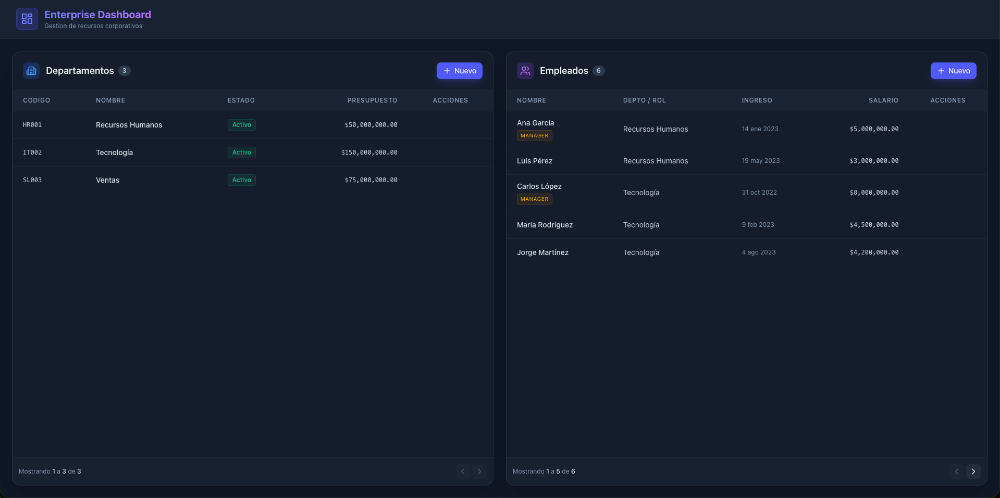
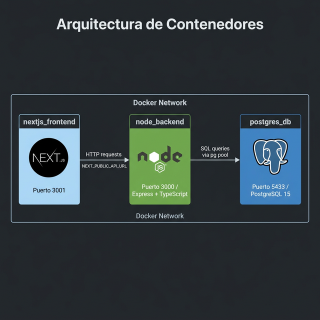

# Enterprise Manager

Aplicación fullstack para gestionar empleados y departamentos de una empresa, orquestada completamente con **Docker Compose**.

## Captura de pantalla



---

## Arquitectura de contenedores



El sistema está compuesto por tres contenedores que se comunican dentro de la misma red de Docker:

| Contenedor | Imagen / Tecnología | Puerto expuesto |
|---|---|---|
| `nextjs_frontend` | Next.js 15 + React | `3001` |
| `node_backend` | Node.js 20 + Express + TypeScript | `3000` |
| `postgres_db` | PostgreSQL 15 Alpine | `5433` |

---

## Requisitos previos

- [Docker](https://docs.docker.com/get-docker/) >= 24
- [Docker Compose](https://docs.docker.com/compose/install/) >= 2

> No necesitas tener Node.js ni PostgreSQL instalados localmente. Todo corre dentro de Docker.

---

## Estructura del proyecto

```
.
├── backend/              # API REST (Express + TypeScript)
│   ├── src/
│   │   ├── index.ts      # Punto de entrada, rutas y controladores
│   │   └── db.ts         # Configuración del pool de conexión a PostgreSQL
│   └── Dockerfile
├── frontend/             # Interfaz de usuario (Next.js)
│   ├── src/
│   └── Dockerfile
├── db/
│   └── init.sql          # Script de inicialización de la base de datos
├── docs/                 # Recursos para documentación
├── docker-compose.yml
└── .gitignore
```

---

## Cómo levantar el proyecto

### 1. Clonar el repositorio

```bash
git clone https://github.com/mauricioPallares/cotainer1.git
cd cotainer1
```

### 2. Construir e iniciar los contenedores

```bash
docker compose up --build
```

Este comando realiza los siguientes pasos automáticamente:

1. **Construye** las imágenes del backend y el frontend a partir de sus respectivos `Dockerfile`.
2. **Inicia** el contenedor de PostgreSQL y ejecuta `db/init.sql` para crear las tablas e insertar datos de prueba.
3. **Inicia** el backend en modo desarrollo (`npm run dev`).
4. **Inicia** el frontend en modo desarrollo (`npm run dev`).

> La primera vez puede tardar unos minutos mientras se descargan las imágenes base y se instalan las dependencias.

### 3. Verificar que todo está corriendo

```bash
docker compose ps
```

Deberías ver los tres contenedores con estado `running`.

### 4. Acceder a la aplicación

| Servicio | URL |
|---|---|
| Frontend | http://localhost:3001 |
| Backend (API) | http://localhost:3000 |
| Health check | http://localhost:3000/health |

---

## Esquema de base de datos

### Tabla `departments`

| Columna | Tipo | Descripción |
|---|---|---|
| `id` | SERIAL | Clave primaria |
| `name` | VARCHAR(100) | Nombre del departamento |
| `code` | CHAR(5) | Código único |
| `budget` | NUMERIC(15,2) | Presupuesto |
| `is_active` | BOOLEAN | Estado activo/inactivo |
| `max_employees` | INTEGER | Máximo de empleados |
| `created_at` | TIMESTAMP | Fecha de creación |

### Tabla `employees`

| Columna | Tipo | Descripción |
|---|---|---|
| `id` | SERIAL | Clave primaria |
| `department_id` | INTEGER | FK a `departments` |
| `first_name` | VARCHAR(50) | Nombre |
| `last_name` | VARCHAR(50) | Apellido |
| `hire_date` | DATE | Fecha de contratación |
| `is_manager` | BOOLEAN | Es jefe de área |
| `salary` | NUMERIC(10,2) | Salario |

---

## Endpoints de la API

### Departamentos

| Método | Ruta | Descripción |
|---|---|---|
| `GET` | `/api/departments` | Listar todos los departamentos |
| `POST` | `/api/departments` | Crear un departamento |
| `PUT` | `/api/departments/:id` | Actualizar un departamento |
| `DELETE` | `/api/departments/:id` | Eliminar un departamento |

**Ejemplo — crear departamento:**

```bash
curl -X POST http://localhost:3000/api/departments \
  -H "Content-Type: application/json" \
  -d '{
    "name": "Marketing",
    "code": "MK004",
    "budget": 80000,
    "is_active": true,
    "max_employees": 15
  }'
```

### Empleados

| Método | Ruta | Descripción |
|---|---|---|
| `GET` | `/api/employees` | Listar todos los empleados |
| `POST` | `/api/employees` | Crear un empleado |
| `PUT` | `/api/employees/:id` | Actualizar un empleado |
| `DELETE` | `/api/employees/:id` | Eliminar un empleado |

**Ejemplo — crear empleado:**

```bash
curl -X POST http://localhost:3000/api/employees \
  -H "Content-Type: application/json" \
  -d '{
    "department_id": 2,
    "first_name": "Sofía",
    "last_name": "Torres",
    "hire_date": "2024-03-01",
    "is_manager": false,
    "salary": 4800
  }'
```

---

## Detener los contenedores

```bash
# Detener sin eliminar volúmenes
docker compose down

# Detener y eliminar volúmenes (limpia la base de datos)
docker compose down -v
```

## Ver logs de un contenedor específico

```bash
docker compose logs -f backend
docker compose logs -f frontend
docker compose logs -f db
```

---

## Variables de entorno

Las variables de entorno están definidas directamente en `docker-compose.yml`. Para un entorno de producción se recomienda usar un archivo `.env` y referenciarlo con la directiva `env_file`.

| Variable | Servicio | Valor por defecto |
|---|---|---|
| `DB_HOST` | backend | `db` |
| `DB_USER` | backend | `postgres` |
| `DB_PASSWORD` | backend | `postgrespassword` |
| `DB_NAME` | backend | `enterprise_db` |
| `DB_PORT` | backend | `5432` |
| `PORT` | backend | `3000` |
| `NEXT_PUBLIC_API_URL` | frontend | `http://localhost:3000` |
| `PORT` | frontend | `3001` |
| `POSTGRES_USER` | db | `postgres` |
| `POSTGRES_PASSWORD` | db | `postgrespassword` |
| `POSTGRES_DB` | db | `enterprise_db` |
